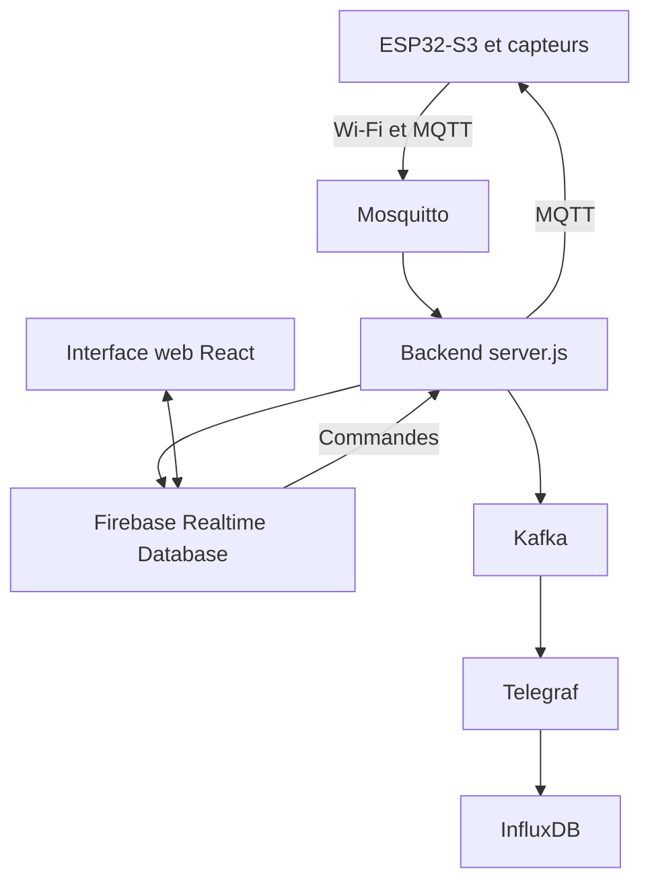

Voici le fichier `README.md` complet et mis à jour avec vos liens de dépôt, l'intégration des dossiers de votre capture d'écran, et les spécifications techniques de votre projet.

```markdown
# Smart Aquarium — Surveillance intelligente par TinyML

## Présentation

Ce dépôt contient les éléments logiciels développés dans le cadre du projet de Master visant le suivi écologique de truites arc-en-ciel, intitulé :

**« TinyML pour la surveillance intelligente d’un aquarium : conception et réalisation d’un prototype Edge AI basé sur ESP32-S3 »**

Le système assure l’acquisition des paramètres de l’aquarium, la commande locale ou distante des actionneurs, l’historisation des données et la détection locale d’anomalies. Le traitement TinyML est exécuté sur l’ESP32-S3 afin de limiter la dépendance au réseau pour l’analyse des mesures.

## Fonctionnalités principales

* mesure de la température, du pH et du TDS ;
* surveillance du niveau d’eau et de la luminosité ;
* commande du chauffage, de la filtration, de l’oxygénation et de l’éclairage ;
* distribution automatique de nourriture ;
* fonctionnement en mode manuel ou automatique ;
* transmission de la télémétrie par MQTT ;
* supervision à distance à travers une interface web ;
* stockage distant dans Firebase Realtime Database ;
* historisation locale des séries temporelles dans InfluxDB ;
* détection d’anomalies par un modèle K-Means exécuté sur l’ESP32-S3 ;
* signalement des anomalies par une alerte et un buzzer ;
* identification des aquariums par un `device_id`.

## Architecture générale



### Flux de télémétrie

La télémétrie suit le chemin suivant :

`ESP32-S3 → Wi-Fi → Mosquitto → server.js`

Le backend distribue ensuite les données vers deux branches :

* Firebase Realtime Database pour la supervision en temps réel ;
* Kafka, Telegraf et InfluxDB pour l’historisation locale des séries temporelles.

### Flux de commande

Les commandes suivent le chemin suivant :

`Interface web → Firebase → server.js → Mosquitto → ESP32-S3`

L’interface web utilise la synchronisation en temps réel de Firebase pour afficher les mesures et transmettre les commandes. Elle ne dépend pas d’une connexion WebSocket directe avec le backend.

## Matériel utilisé

* ESP32-S3-WROOM-1 N16R8 ;
* Raspberry Pi 4B avec 4 Go de mémoire vive ;
* capteur de température DS18B20 ;
* sonde de pH E-201 avec module analogique ;
* capteur TDS ;
* photorésistance GL5528 ;
* capteur à ultrasons HC-SR04 ;
* capteur de niveau à flotteur ;
* servomoteur SG90 ;
* buzzer ;
* chauffage, filtration, pompe d’oxygénation et éclairage LED ;
* modules relais pour la commande des actionneurs.

## Technologies utilisées

| Couche | Technologies |
| --- | --- |
| Système embarqué | ESP32-S3, Arduino/C++ |
| Communication | Wi-Fi, MQTT, Mosquitto |
| Passerelle locale | Raspberry Pi 4B, Node.js, `server.js` |
| Traitement des flux | Apache Kafka, Telegraf |
| Stockage local | InfluxDB |
| Service distant | Firebase Realtime Database |
| Interface utilisateur | React, Firebase Hosting |
| TinyML | Edge Impulse, K-Means |

## Détection d’anomalies TinyML

Le modèle de détection d’anomalies a été développé avec Edge Impulse. Il utilise un apprentissage non supervisé fondé sur l’algorithme K-Means.

Les variables d’entrée sont :

* la température ;
* le pH ;
* le TDS.

Le jeu de données utilisé dans la version documentée du projet représente une durée totale de **42 h 47 min 50 s**. Il a été réparti en **81 % pour l’entraînement** et **19 % pour le test**.

Le modèle produit un score représentant la distance entre les nouvelles observations et les groupes appris à partir des données normales. Le seuil d’anomalie a été fixé expérimentalement à :

`T = 5`

Ce choix repose sur l’observation des scores obtenus pendant le fonctionnement considéré comme normal, dont les valeurs restent généralement inférieures à ce seuil. Lorsque le score dépasse `5`, le système génère l’alerte `IA_DERIVE_DETECTEE` et peut activer le buzzer. Cette alerte constitue une aide à la décision et ne désactive pas la régulation classique fondée sur les seuils des capteurs.

## Organisation des données

Chaque message de télémétrie contient un identifiant `device_id`. Celui-ci permet d’associer les mesures au dispositif concerné et prépare l’architecture à la gestion de plusieurs aquariums.

Exemple simplifié d’un message :

```json
{
  "device_id": "aqua_01",
  "temperature": 25.4,
  "ph": 7.0,
  "tds": 320,
  "niveau_eau": 75,
  "luminosite": 410,
  "anomaly_score": 1.8
}

```

Le topic MQTT utilisé pour la télémétrie du prototype est :

```text
aquarium/aqua_01/telemetry

```

## Installation

### 1. Cloner le dépôt

```bash
git clone [https://github.com/AAFFAN-Ayoub/Aquarium_PFE.git](https://github.com/AAFFAN-Ayoub/Aquarium_PFE.git)
cd Aquarium_PFE

```

### 2. Préparer le firmware de l’ESP32-S3

1. Ouvrir le dossier `espS3` dans l’environnement de développement (Arduino IDE ou PlatformIO).
2. Installer les bibliothèques nécessaires aux capteurs, à MQTT et au modèle Edge Impulse.
3. Configurer :
* le nom et le mot de passe du réseau Wi-Fi ;
* l’adresse IP du broker Mosquitto ;
* le port MQTT ;
* le `device_id`.


4. Compiler le programme et téléverser le firmware vers l’ESP32-S3.

### 3. Préparer la passerelle Raspberry Pi

Installer et configurer les services locaux :

* Mosquitto ;
* Node.js ;
* Apache Kafka en mode KRaft ;
* Telegraf ;
* InfluxDB 2.x.

Configurer ensuite le backend avec les paramètres MQTT, Firebase, Kafka et InfluxDB correspondant à l’environnement de déploiement. L'architecture serveur locale doit être configurée avec des certificats TLS/HTTPS stricts, sans autorisation de basculement (fallback) vers des protocoles HTTP non chiffrés.

### 4. Installer le backend

```bash
cd aquarium-backend
npm install
npm start

```

La route suivante peut être utilisée pour vérifier que le backend répond :

```text
GET /api/health

```

Cette route sert uniquement au diagnostic local. Une réponse positive confirme que l’API est accessible, mais ne garantit pas à elle seule que tous les services externes fonctionnent correctement.

### 5. Installer l’interface web


```bash
cd Figma maquette
npm install
npm run build

```

L’interface doit être configurée avec les paramètres du projet Firebase avant sa compilation ou son déploiement.

## Sécurité des informations sensibles

Les informations suivantes ne doivent pas être publiées dans le dépôt (ajoutez-les à votre fichier `.gitignore`) :

* mots de passe Wi-Fi ;
* jetons InfluxDB ;
* comptes de service Firebase ;
* clés privées ;
* identifiants administrateur ;
* fichiers `.env` contenant des informations sensibles.

Un fichier `.env.example` peut être fourni pour indiquer les paramètres nécessaires sans exposer leurs valeurs réelles.

## Limites de la version actuelle

* Le modèle K-Means dépend de la représentativité des données utilisées pendant l’entraînement.
* Le seuil d’anomalie a été choisi à partir des observations du prototype et devra être réévalué pour un autre aquarium.
* La détection TinyML complète la régulation classique, mais ne la remplace pas.
* L’extension à plusieurs aquariums nécessite une adaptation des souscriptions MQTT si le backend écoute uniquement le topic de `aqua_01`.
* La conservation des données InfluxDB dépend de la capacité de stockage de la carte microSD et de la politique de rétention configurée.

## Auteur

**Nom :** Ayoub AAFFAN
**Formation :** Master en Ingénierie Informatique et Systèmes Embarqués
**Établissement :** Centre d'excellence d'Agadir
**Année universitaire :** 2025/2026

## Licence

Ce projet a été réalisé dans un cadre académique.

